# UML建模
## 用例图
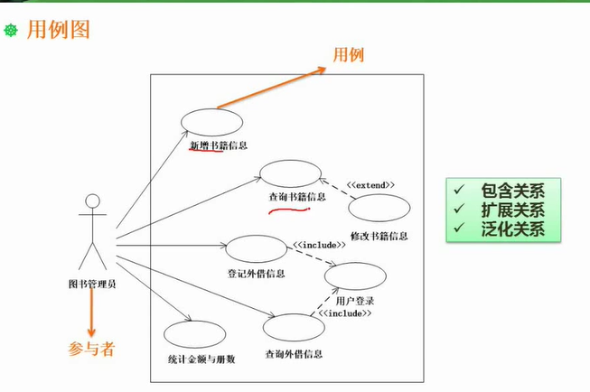 
include 属于必需用例，extend属于扩展用例

## 类图与对象图
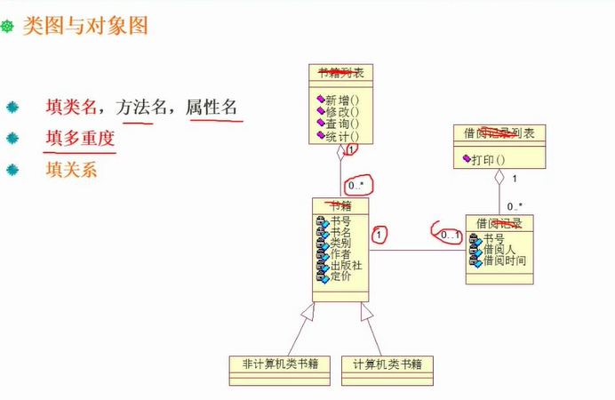

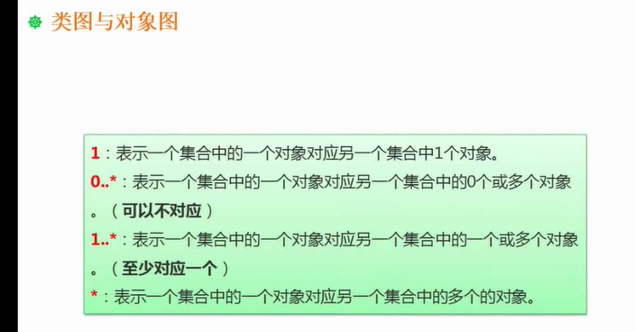

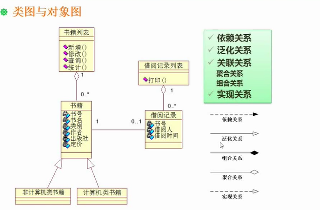

## 顺序图

顺序图重点考察消息，注意消息的作用 ，其次考察对象名

## 活动图

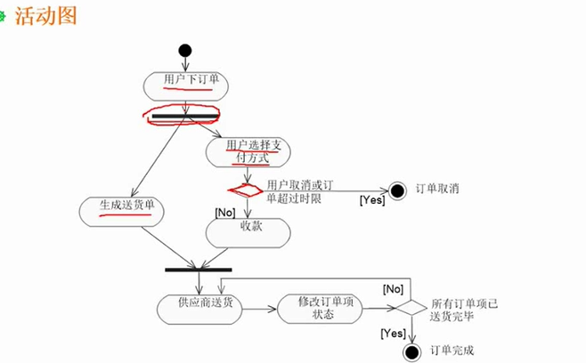

粗横线表示，产生分支和分支合并

* 带泳道的活动图
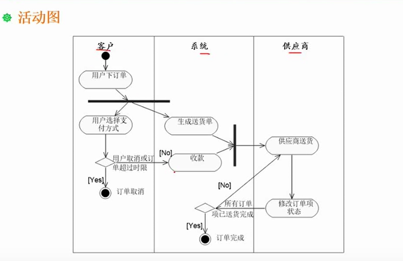

## 状态图
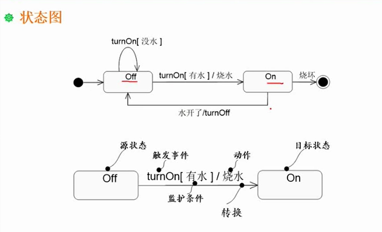
主要考察状态的变迁，以及变迁的条件

## 通信图
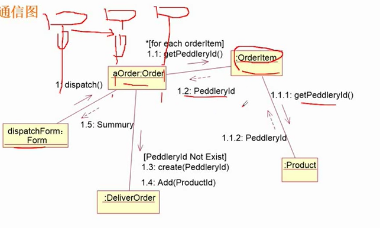

顺序图和通讯图的差异主要在于顺序图会强调时间顺序

## 试题
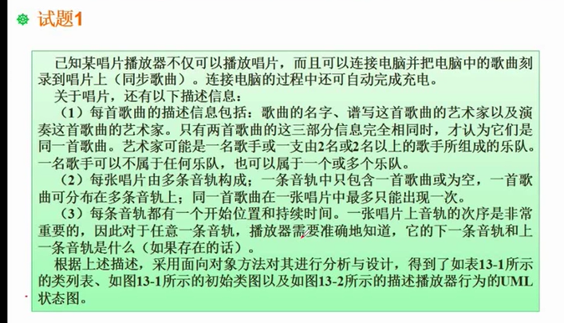

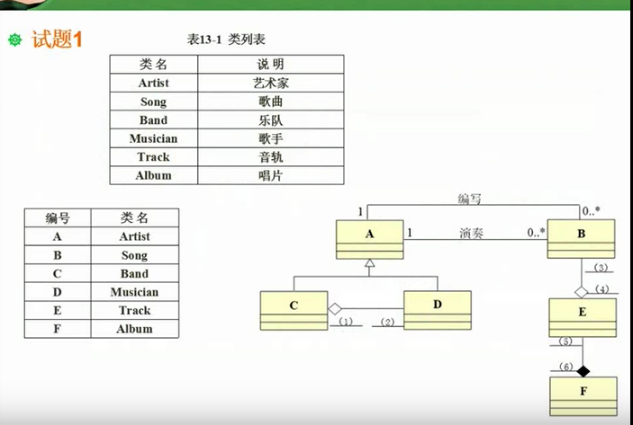

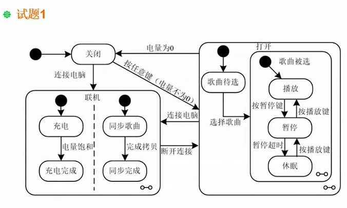

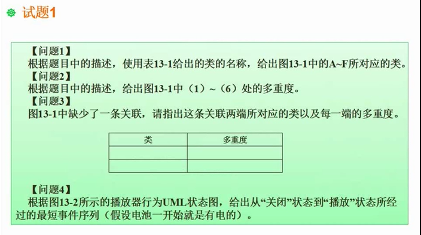

问题1：
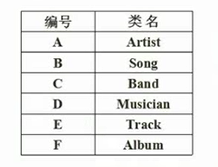
问题2：
（1）0..*（2） 2..*  (3)0..1  (4) 1..* (5) 1..* (6) 1
问题3：
Track  0..1
Track  0..1
问题4：
按任意键-》播放