# 开发模型
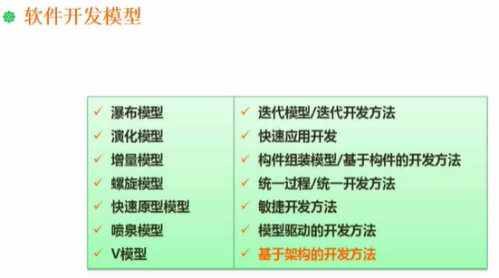

## 瀑布模型
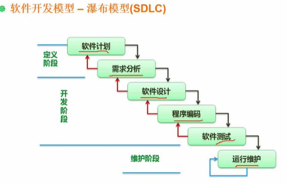
适合需求明确或者二次开发的项目

## 原型模型，演化模型，增量模型
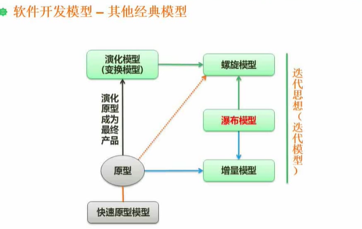
原型针对需求不明确的情况下，只应用于开发需求阶段
从原型经过多轮的演化成软件产品，则是演化模型
有原型和瀑布模型思想为增量模型，例子：先从核心模块开发，然后逐步开发其他模块

## 螺旋模型

螺旋模型有原型，演变模型和瀑布模型的结合，其一大特点有风险分析

## V模型
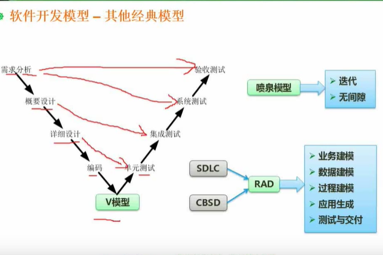
与瀑布模型不同的是，在各个阶段前都要进行测试设计。逐层验收

### 喷泉模型与开发模型（RAD）
是面向对象的模型
RAD由瀑布模型（SDLC）与构建组装模型（CBSD）组成。例如使用IDE开发工具

## 构件组装模型
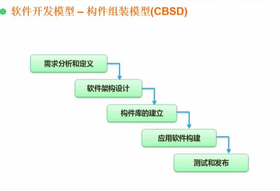

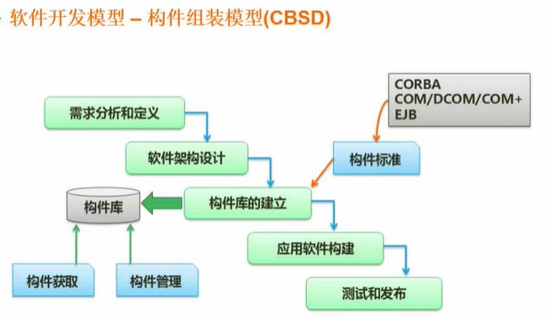

## 软件开发模型
### 敏捷开发方法
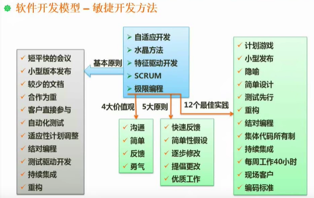

适应小型项目，不适宜大项目

### 信息系统开发方法
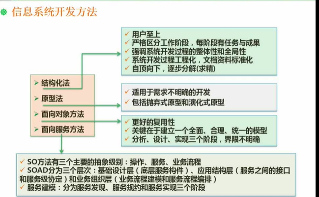

结构化法的缺点为流程固定，开发完成之后不好进行修改。

## 需求的分类
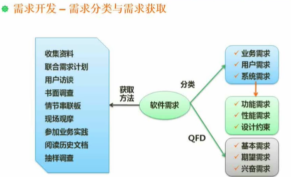

## 结构化设计
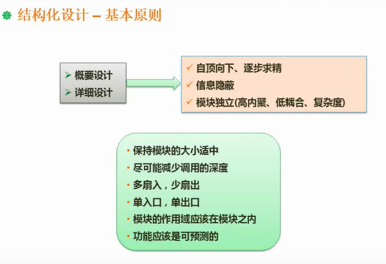

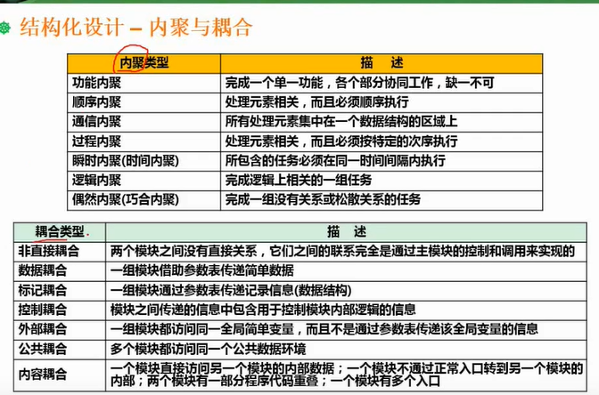

## 软件测试

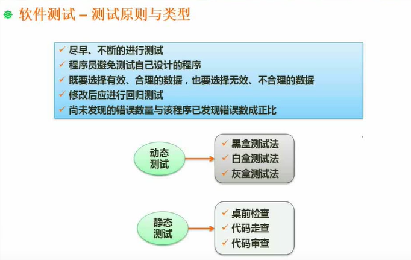

### 测试用例设计
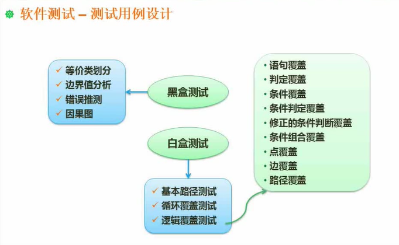

### 测试阶段
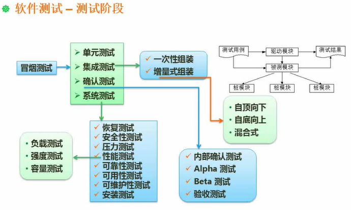

### McCabe复杂度
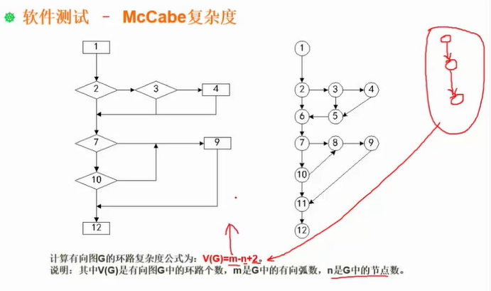

## 系统运行与维护
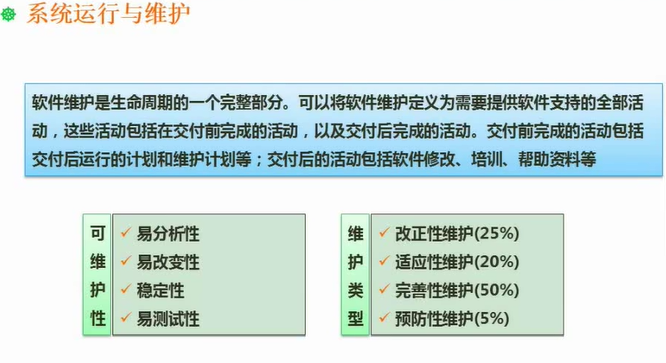

## 软件过程改进-CMMI
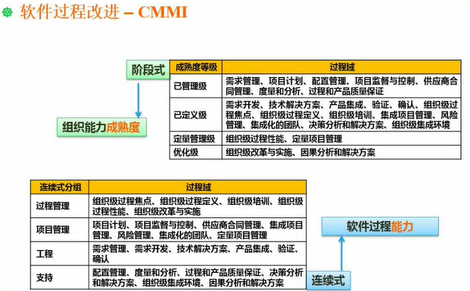

## 项目管理
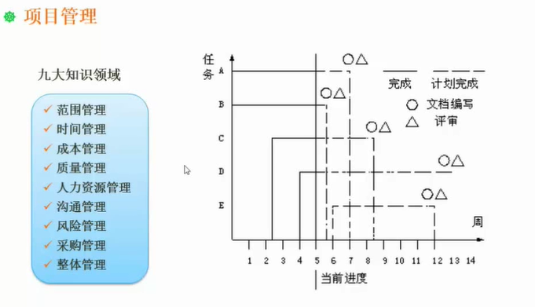

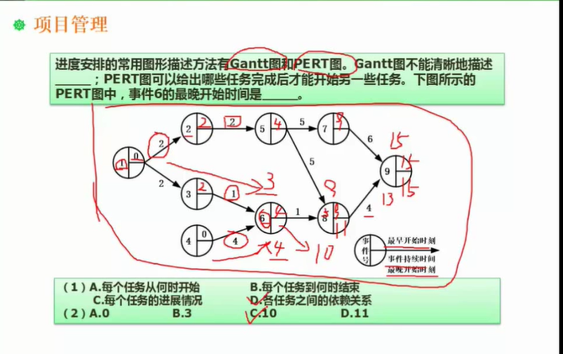
最晚开始时间先求最晚时间再逆推

### 项目管理
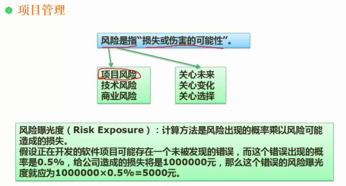