# 数据库设计
## 数据库设计过程
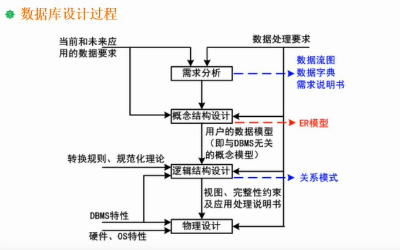

## ER模型
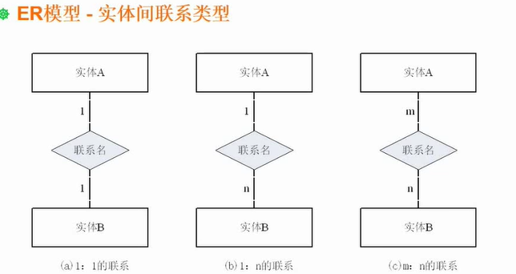

## 答题技巧
1. 详细分析试题说明
2. 熟练掌握基本知识
### 试题1
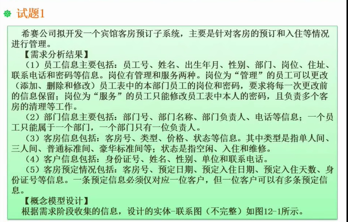

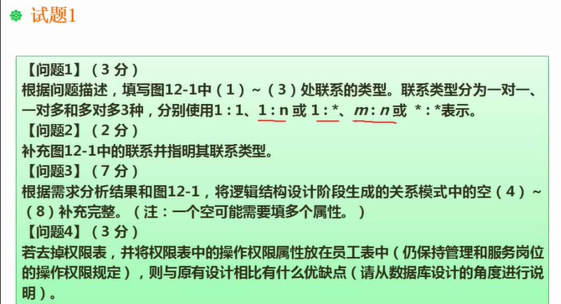

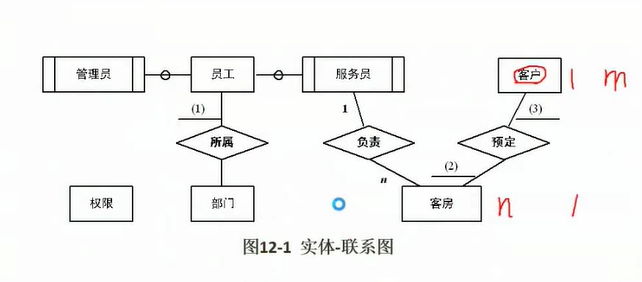
问题1： 
（1）1    （2） n （3）m
问题2：
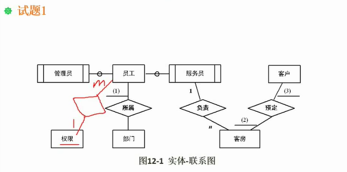
问题3：
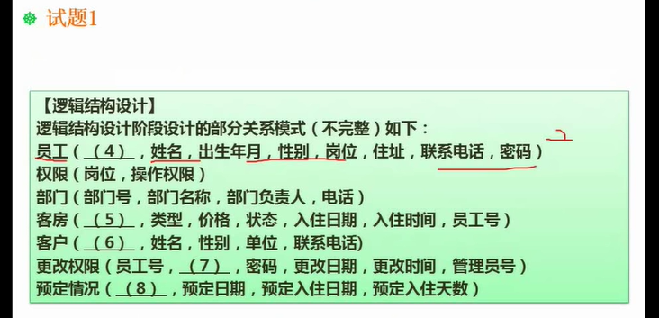
（4） 员工号，部门号
（5） 客房号
（6）身份证号
（7）岗位
（8）身份证号，客房号
问题4 ：
缺点：权限会存多次，造成数据冗余
优点：减少一次联接操作，查询起来速度快一点

### 试题2
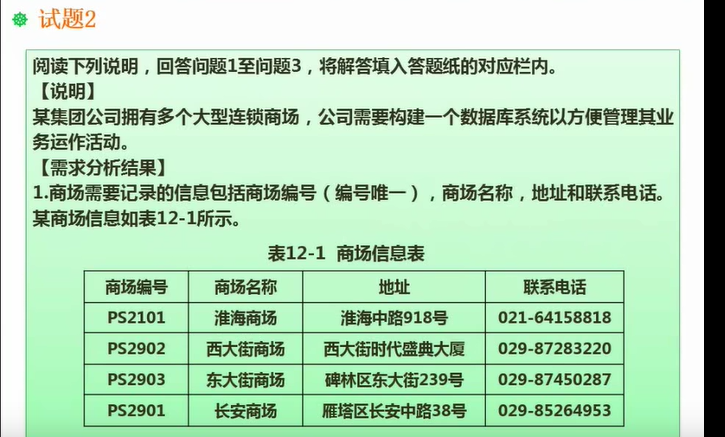

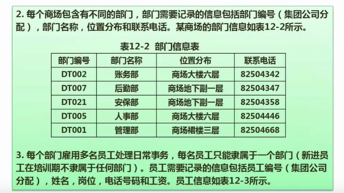

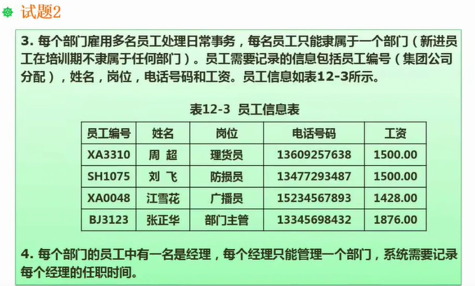

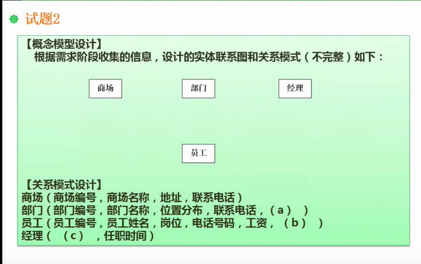

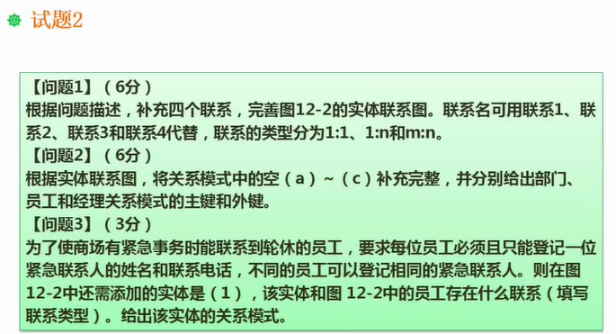

问题1：
值得注意的是经理也属于员工，注意表现方式
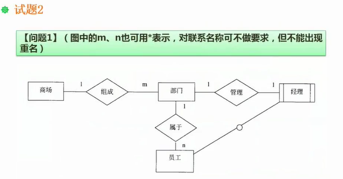

问题2 ：
（a) 商场编号 （b）部门编号  （c）员工编号
部门： 主键是部门编号 ， 外键是商场编号
员工： 主键是员工编号， 外键是部门编号
经理： 主键和外键都是员工编号

问题3 ：
