# 数据流图

## 基本概念
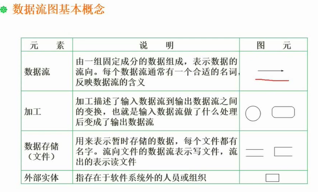

* 示例
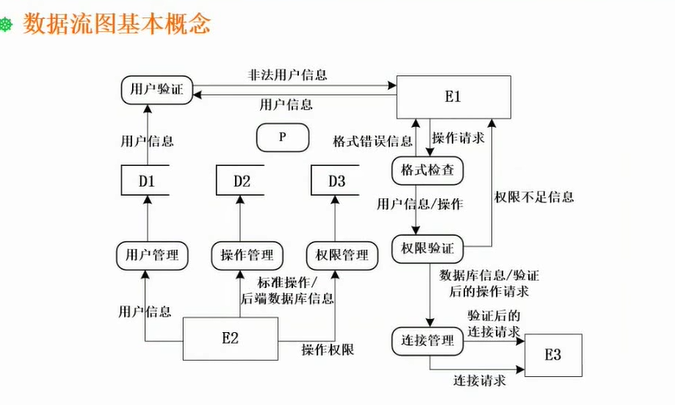

## 数据流图的分层（DFD）
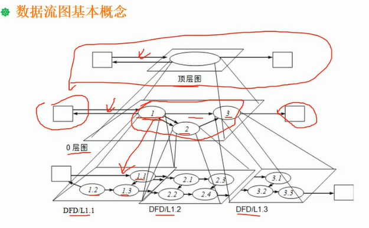

## 数据字典
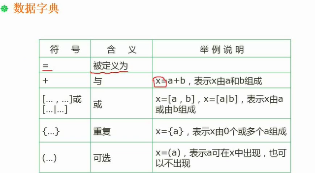

## 平衡原则
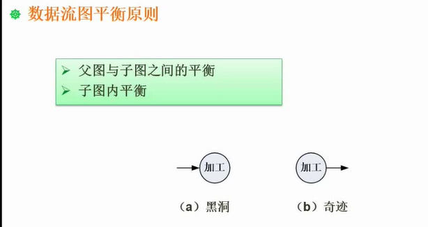

## 答题技巧
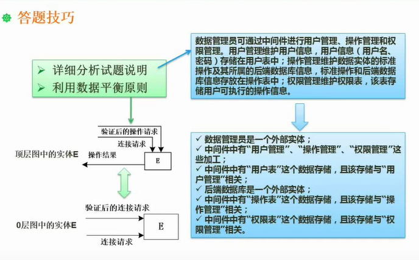
1. 阅读题干
漏洞2. 根据平衡找出
## 案例1
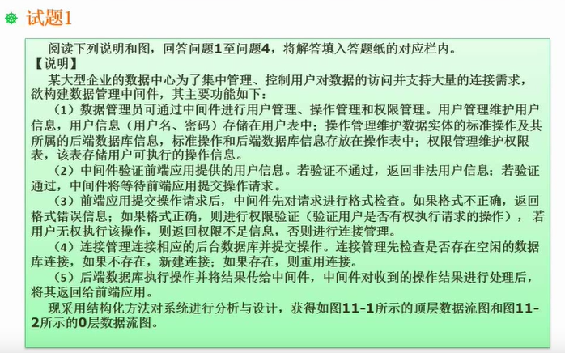

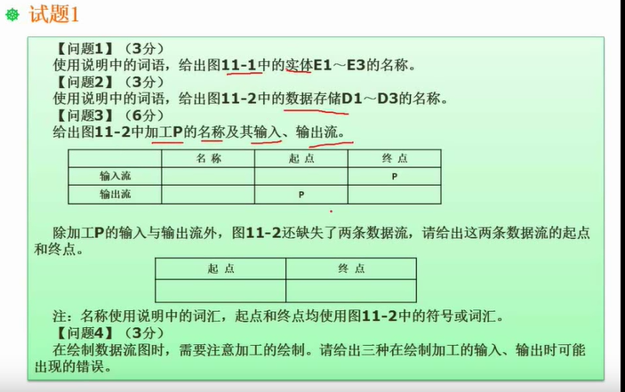

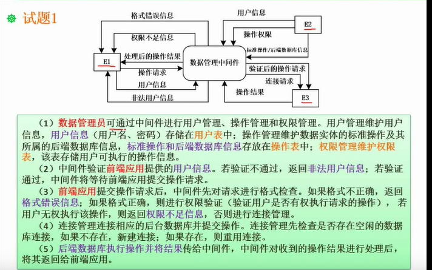

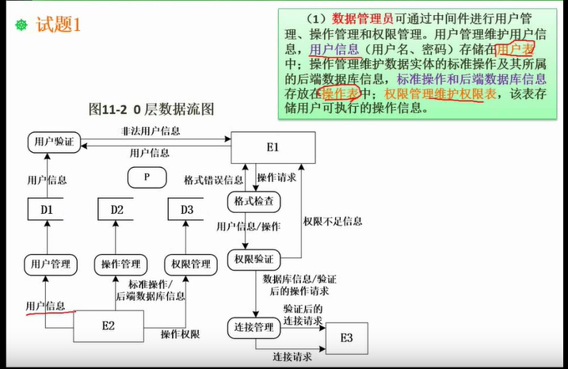
问题1 ： 
E1：前端应用    E2:数据管理员        E3:后端数据库
问题2 ：
D1: 用户表     D2: 操作表        D3:权限表
问题3 ：
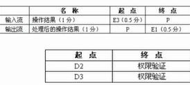
问题4 ：
有输入没输出，有输出没输入，输入输出一致， 输入得到不可能的输出

## 案例二
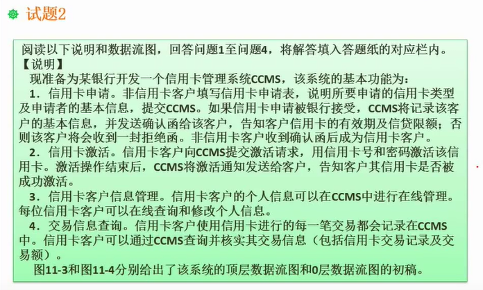

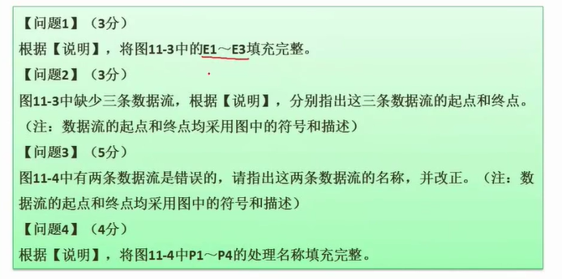

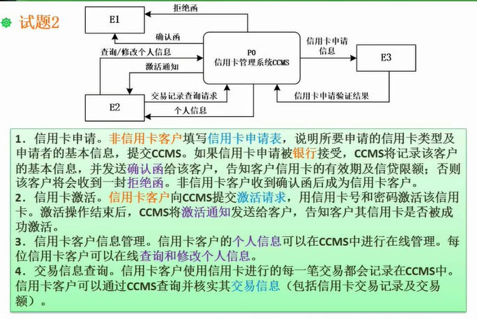

问题1： 
E1 : 非信用客户    E2 : 信用用户     E3: 银行
问题2: 
E1 -> P0 填写信用卡申请表
E2 -> P0 激活请求
P0 -> E2 交易信息
问题3：
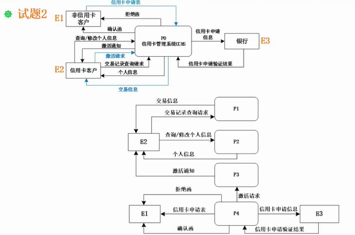

信用卡申请表： E1 -> P4
激活请求： E2 -> P3
问题4：
P1: 交易信息查询 p2:客户信息管理  p3:信用卡激活 p4:信用卡申请
