# 数据结构及算法
## 分治法
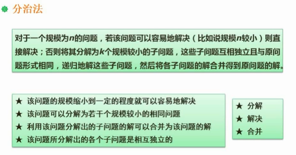

### 递归技术
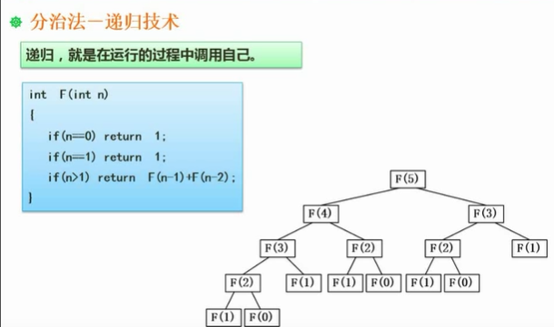

### 二分查找
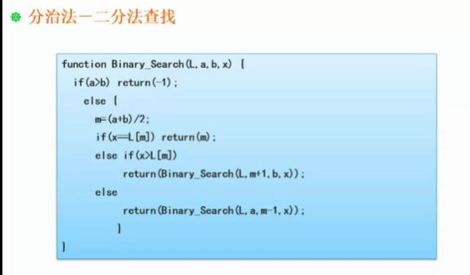

## 回溯法
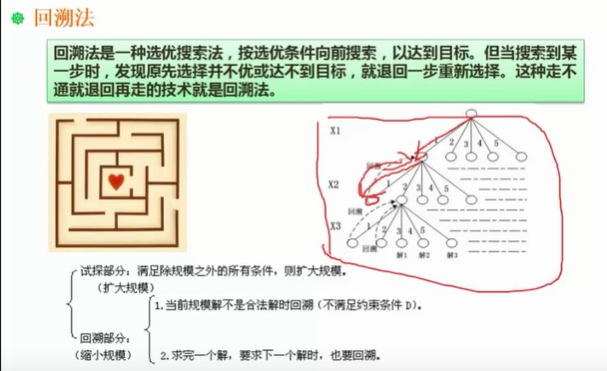

## 贪心算法
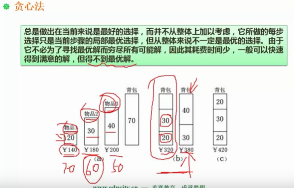

## 动态规划

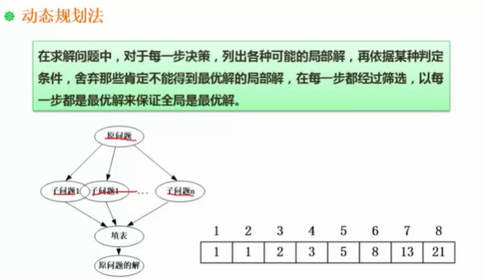

## 试题1
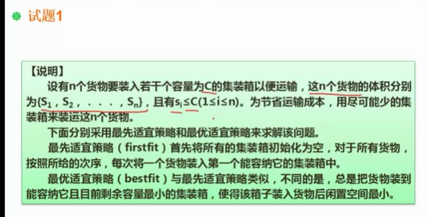

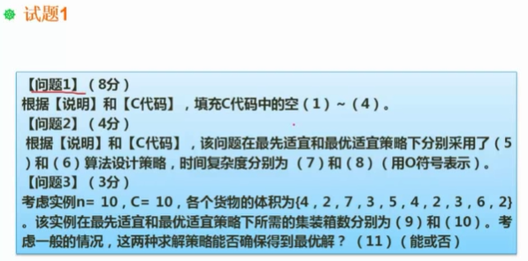
问题1：
（1）j = 0
（2）b[j] = b[j] + s[i]
  (3)   min = temp
  (4)  b[m] = b[m] + s[i] 
问题2：
都是贪心算法，O（n平方） O(n平方)
问题3：
都不能保证最优解
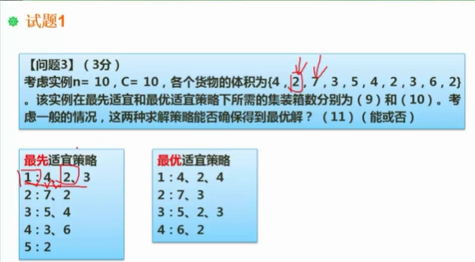

## 试例2

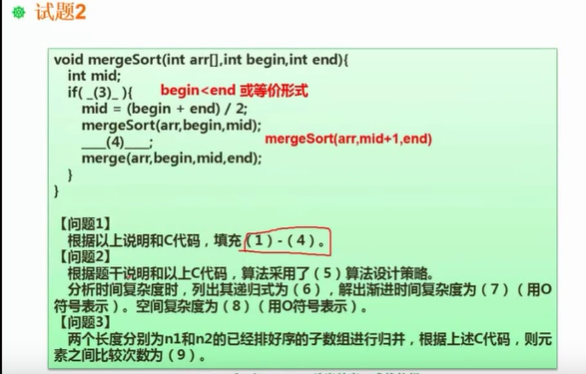

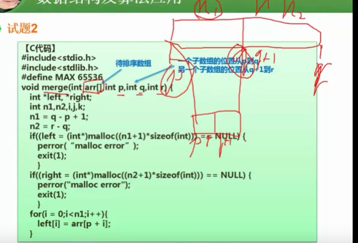

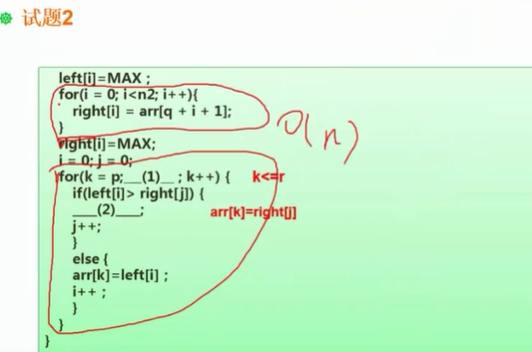
问题1
k <= r
arr[k] = right[j]
begin < end
mergeSort(arr,mid+1,end)

问题2：
分治法
T(n) = 2T(n/2) + O(n)         O（nlogn）        O（n）
问题3：