# 计算机组成与体系结构
## 数据的表示（源码反码补码移码）

原码：正数 -- 转为二进制数
          负数 -- 最高符号位1
反码：正数 -- 与源码一样
          负数 -- 最高符号位不变，其余为原码的的取反
补码：正数 -- 与源码一样
          负数 -- 反码加1
移码： 正数 -- 将补码的首位取反
           负数 -- 将补码的首位取反

* 取值范围
 

## 计算器结构
* CPU结构
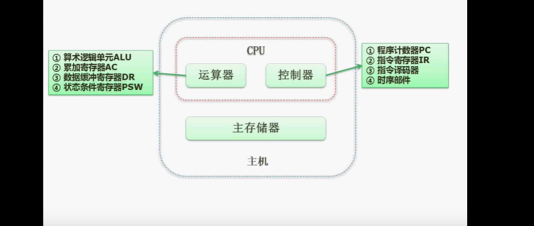
* Flynn分类法简介
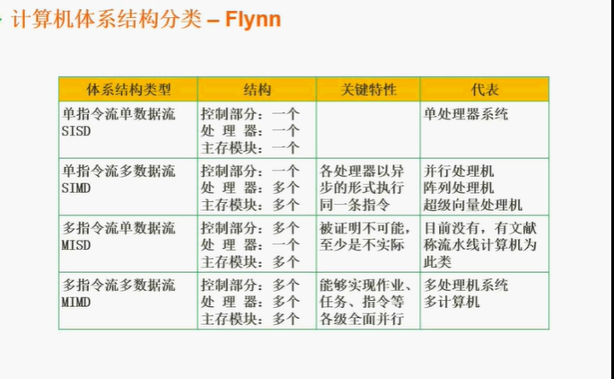

* CISC（复杂）与RISC （精简）
CISC是以前定制化的指令级，RISC更偏向于今天的指令级
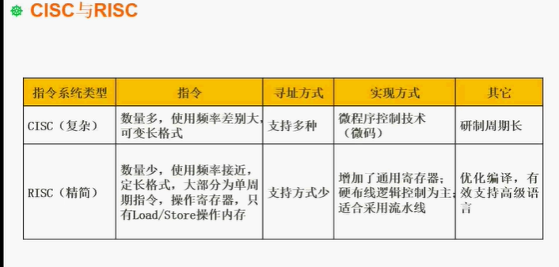

## 流水线
* 流水线描述
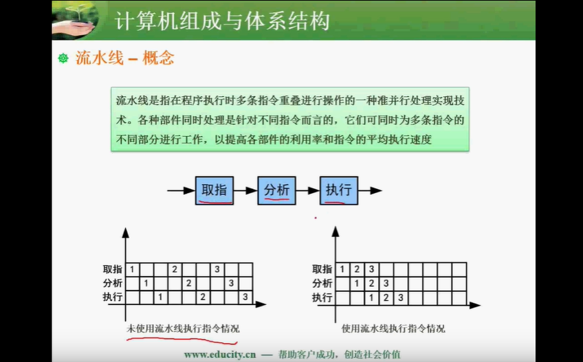
* 流水线时间计算
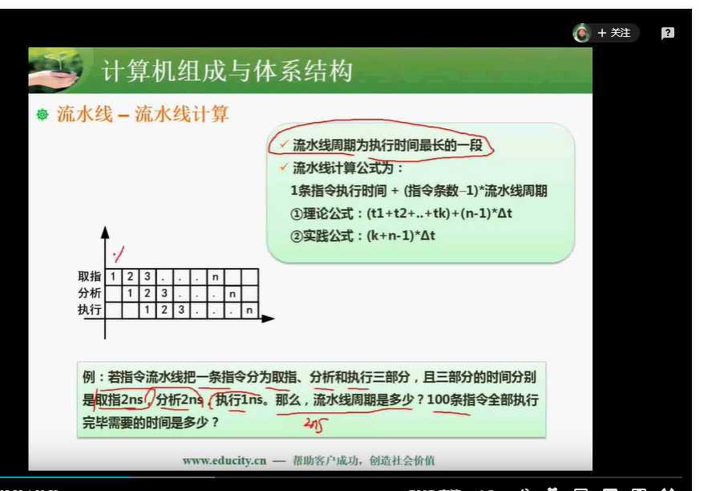

* 流水线-流水线吞吐率计算
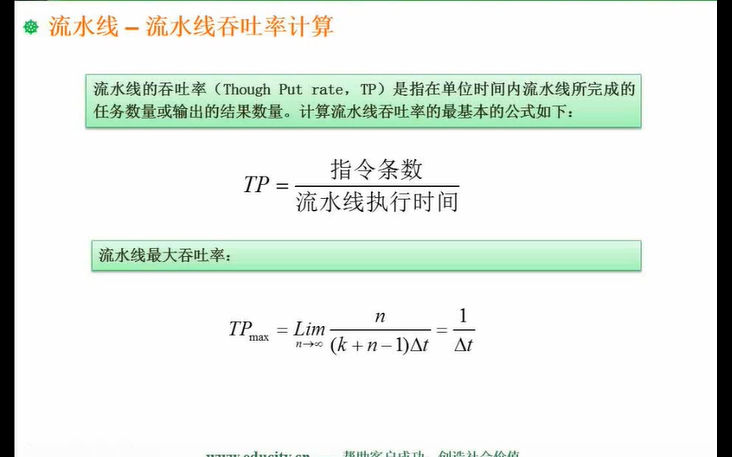
* 流水线-流水线加速比
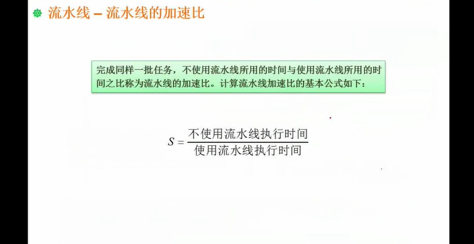
以流水线计算时间的截图为例。不使用流水线指令顺序执行为（1+2+2）* 100 = 500，使用流水线为 5 + 99 * 2 = 203。即500/203。

* 流水线 - 流水线的效率
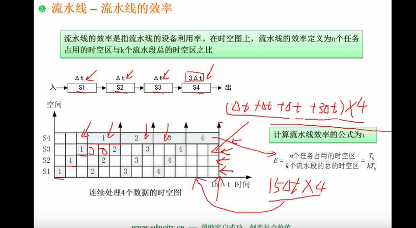

## 计算机层次化存储结构
* 层次化存储结构
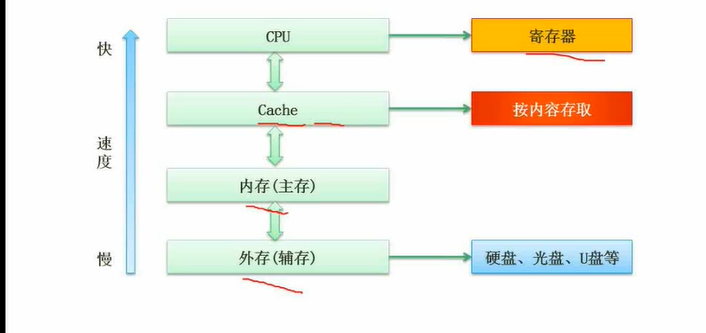

* cache概念
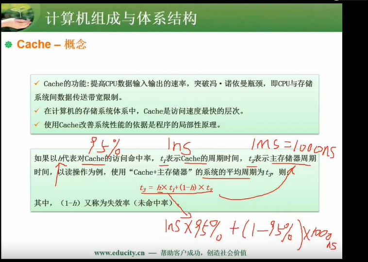
* 主存
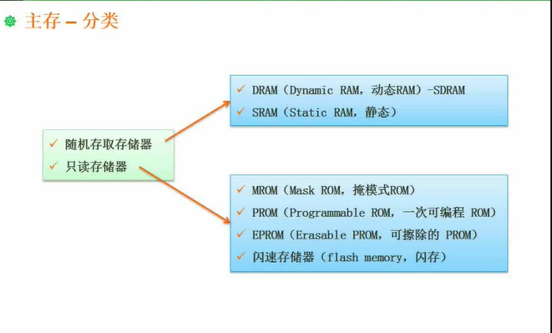

* 外存
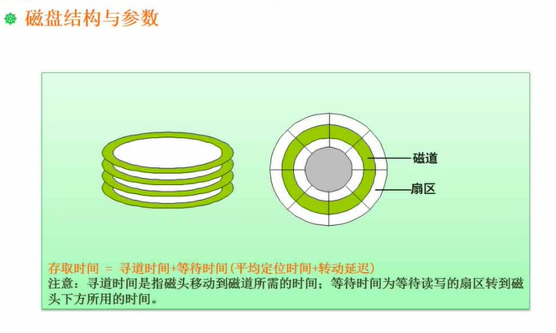

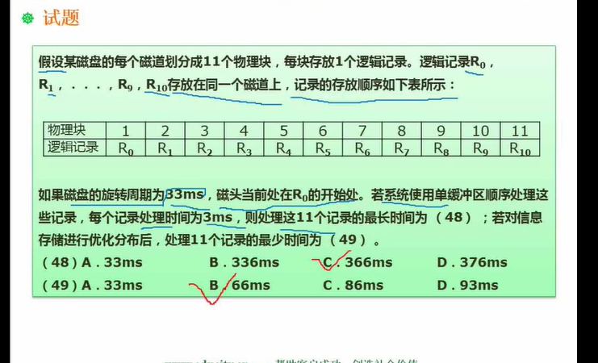
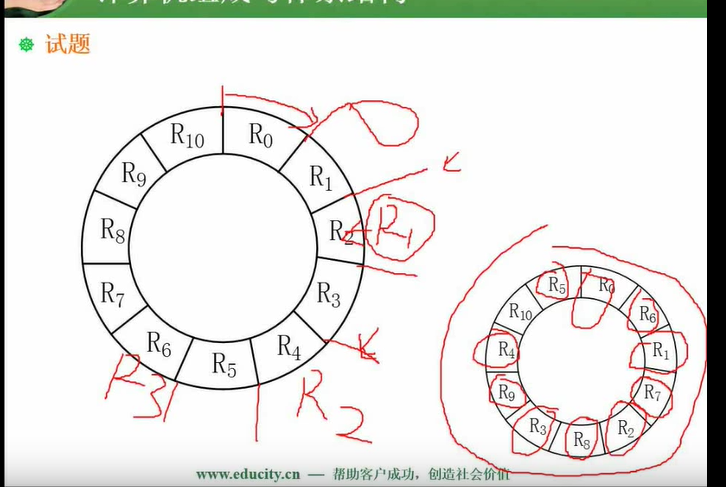

## 计算机总线
* 总线
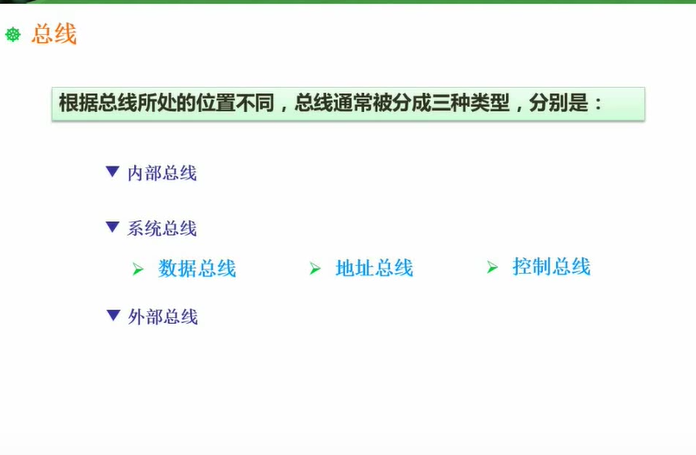
## 系统可靠性
* 系统可靠性分析-串联系统与并联系统
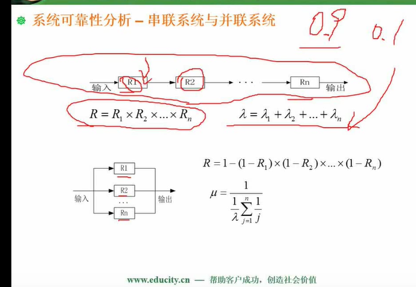

* 系统可靠性分析-模冗余系统与混合系统
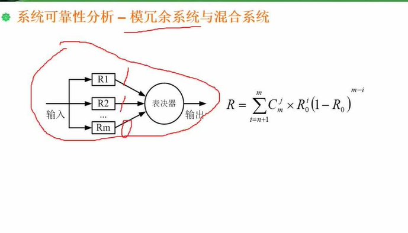
## 校验码
* CRC校验码
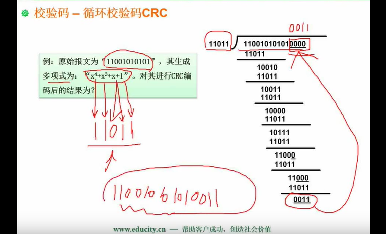
* 海明校验码
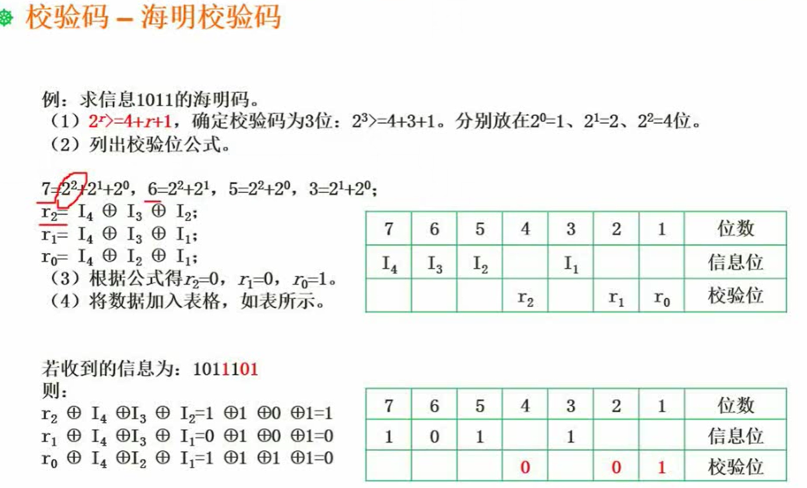