# 计算机网络

## 网络七层模型
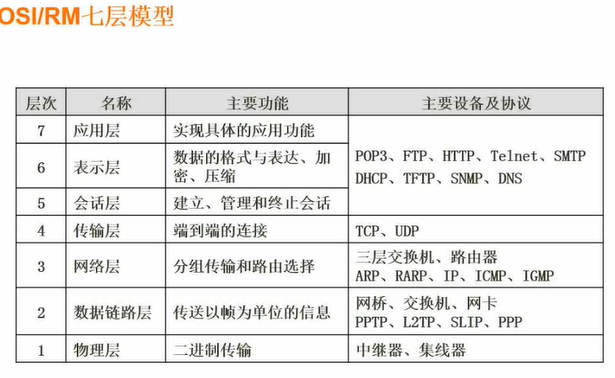

## 网络技术标准与协议
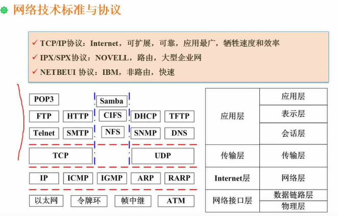
### DHCP协议
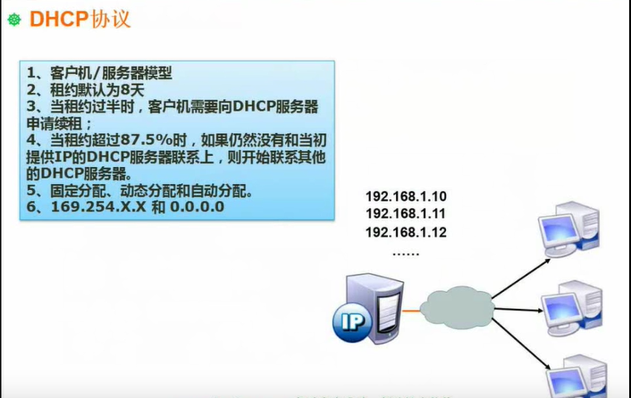
169.254.x.x（windows）与 0.0.0.0 （linux）表示DHCP服务器故障
### DNS协议
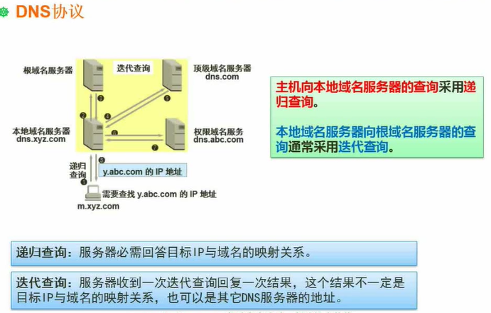

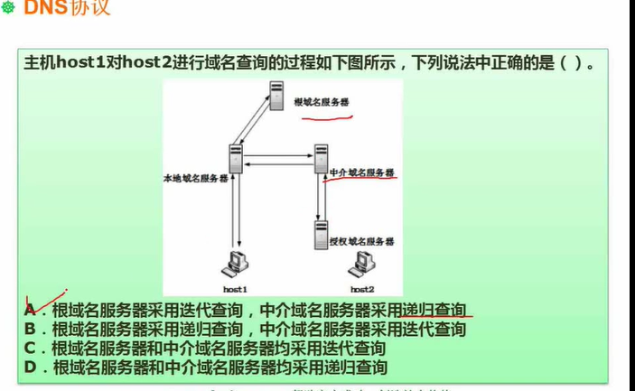

## 计算机网络分类
### 拓扑结构
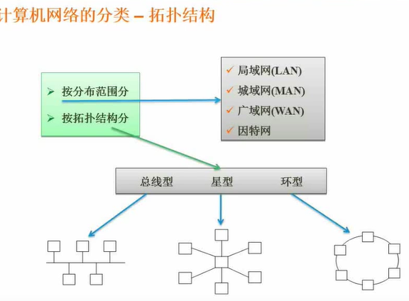

办公室一般使用的是星型，交换机就是中心节点。

## 网络规划与设计
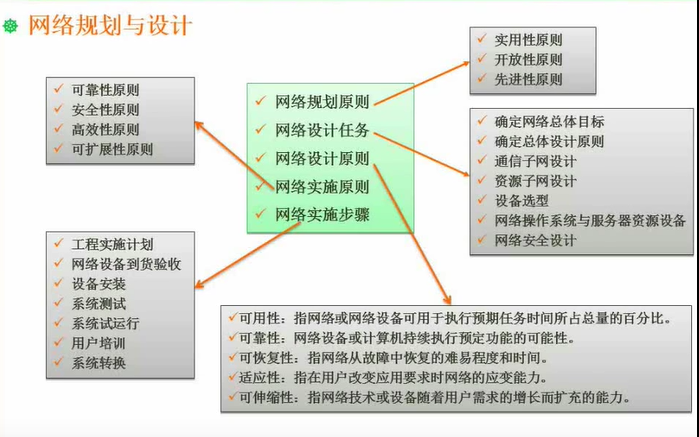
### 逻辑网络设计
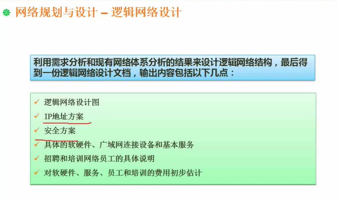

### 分层设计 
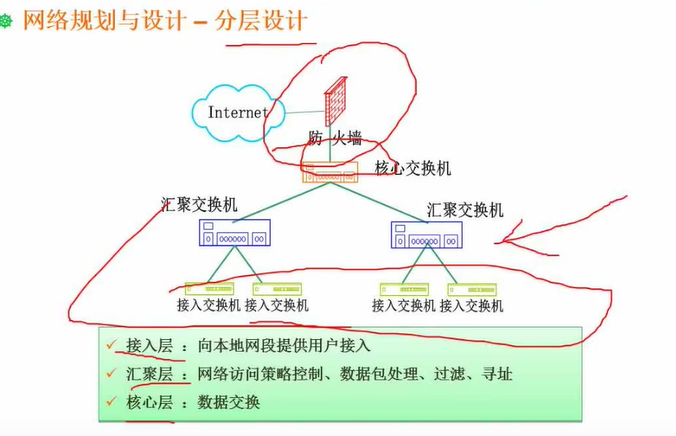

## IP地址
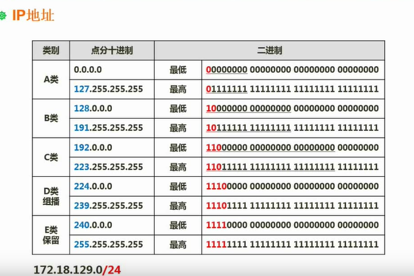

A类地址以0开头，前8个为网络号，一个A类网络所包含的网络地址为2的24次方 - 2
B类地址以10开头 ，前16个为网络号，一个A类网络所包含的网络地址为2的16次方 - 2
C类地址以110开头 ，前24个为网络号，一个A类网络所包含的网络地址为2的8次方 - 2

其中172.18.129.0/24 无分类网络地址 该网络能够容纳的主机数为2的8次方 - 2
### 子网划分
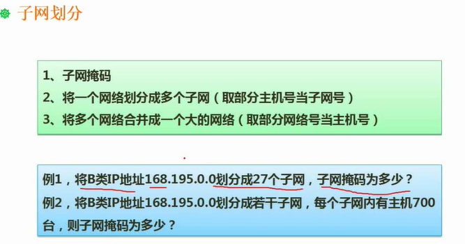
子网为1的是网络号，0对应为主机号

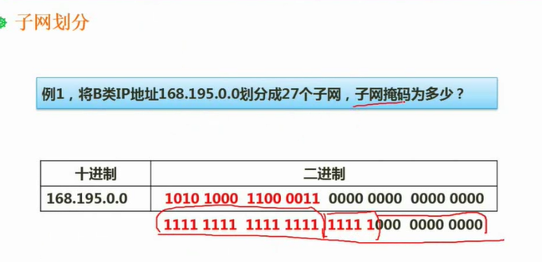

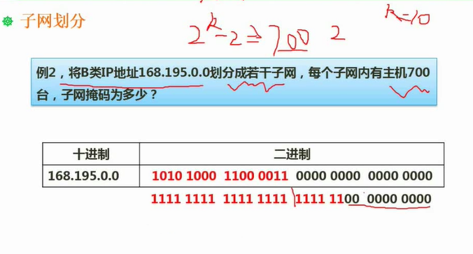

两个IP地址属于同一个子网内判断方法 ：查看网络号与子网号是否相同

## 无分类编址
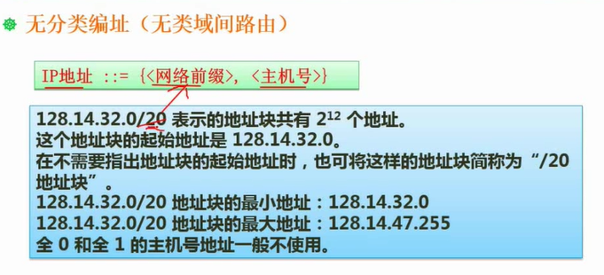

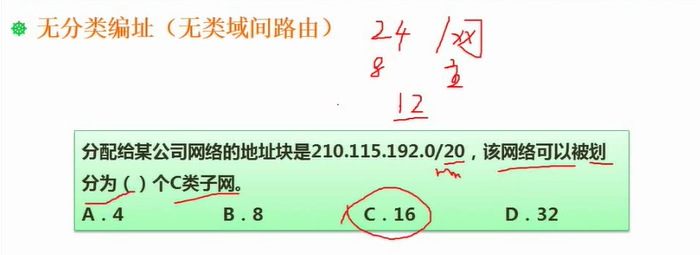

### 特殊含义的IP地址
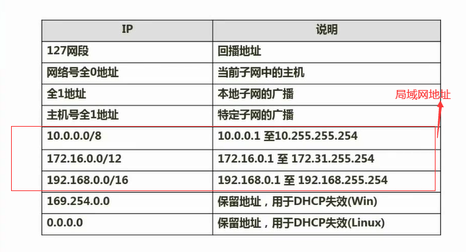

## HTML
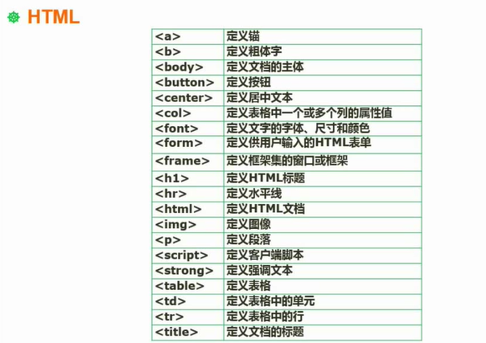

## 无线网
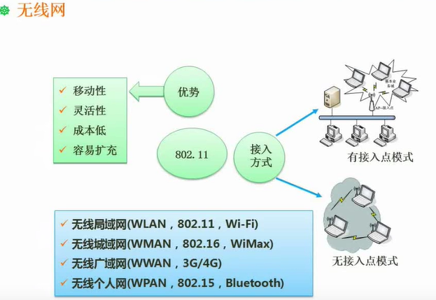

## 网络接入技术
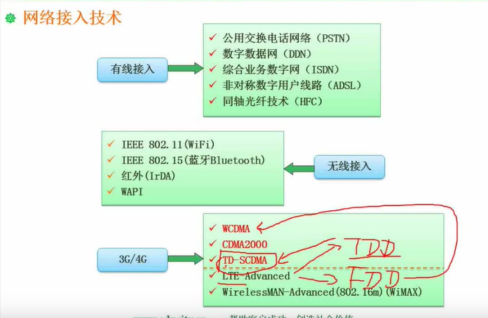
LTE-Advanced可分为TDD与FDD

## IPv6
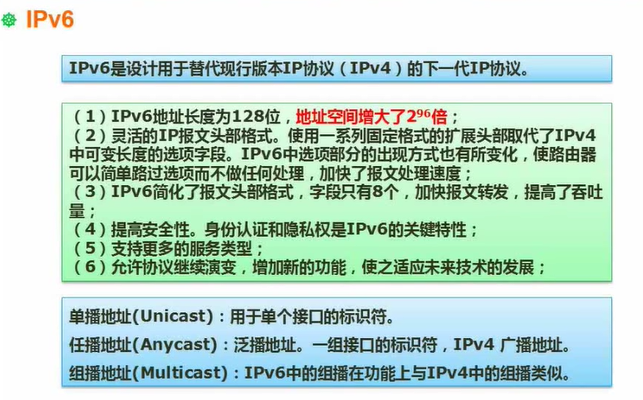